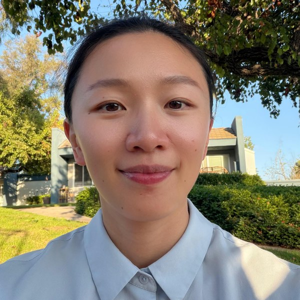

# Speech, Tinnitus, and Cognition Lab

Website for the Speech, Tinnitus, and Cognition (STC) Lab, School of Speech,
Language, and Hearing Sciences, San Diego State University.

Plain static HTML — no build step, no dependencies. GitHub Pages serves these
files directly.

## Editing

| Page | File |
| --- | --- |
| Home | `index.html` |
| Research | `research.html` |
| People | `people.html` |
| Publications | `publications.html` |
| Join Us | `join.html` |
| Styling (colors, fonts, layout) | `assets/style.css` |

To preview a change, open the `.html` file in a browser. What you see locally is
what gets published.

### Adding a photo

Save the image as `assets/pi.jpg`, then in `index.html` and `people.html` replace

```html
<div class="photo-placeholder">Photo coming soon</div>
```

with

```html

```

### Adding a lab member

`people.html` contains a commented-out template block under "Lab Members". Copy
it, remove the `<!--` and `-->` markers, and fill in the details.

### Adding a publication

Copy an existing `<li>` in `publications.html` and edit it. Add a new
`<h3 class="pub-year">` block for a new year.

## Publishing

Committing to the `main` branch republishes the site automatically.

```sh
git add -A
git commit -m "Update site"
git push
```

Changes appear at the live URL within about a minute.
